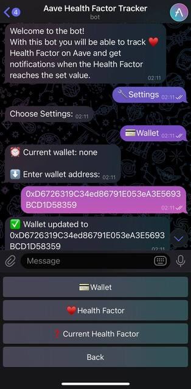

  
  

# Aave Health Factor Checker

Telegram Bot for checking Health Factor on [Aave](https://aave.com/) Crypto Lending Platform.

  

It interacts with the Aave smart contract via RPC to retrieve real-time Health Factor value across all markets presented on the platform.

  

Additionally, you can configure the bot to alert you when the Health Factor reaches a specified critical value that can be set in the bot for better strategy management.

Telegram Bot Available: [@AaveHealthFactorTrackerbot](https://t.me/AaveHealthFactorTrackerbot)
  
## Interface

Adding Wallet to Track

  
  
Setting Up Critical Health Factor
  

Getting Current Health Factor
 

## FAQ

  

#### What is Aave ?

  

Aave is the largest lending platform in Crypto DeFi that allows to lend or borrow assets using smart contracts.

  

It specializes in overcollateralized loans, requiring borrowers to deposit collateral worth more than the amount they wish to borrow, which protects lenders from defaults and enables the liquidation of collateral if its value decreases significantly. Therefore, the concept of health factor was introduced.

  

#### What is Health Factor?

  

The health factor is a key metric on the platform that represents the safety of your deposited assets against the borrowed assets. Which is basically a numeric representation of your liquidation risk of the collateral supplied.

#### Is Bot Free to Use?

This tool is available for everyone to use without any features restrictions.